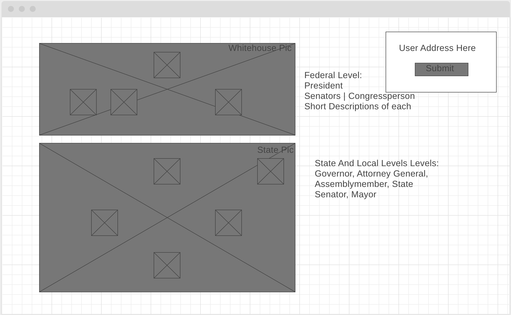

# Get Gov

Get Gov is a site where users can input their address and visually see their representatives from all levels of government. It would be clearly organized so they can tell federal from state and municipal.

# Background and Overview

Too often American politicians are seen as celebrities to be photographed and worshipped instead of what they are: elected officials tasked with the job of representing your interests in our government. They work for you. To best do their job, it's important they have a clear idea of what it is that will win your approval and ultimately your vote. Most of the time they form an _**idea**_ of what your opinion is based on demographics and your voting record, but this system can, at best, only give them an _**idea**_ of your interests. 

The work they do directly affects our lives, yet few constituents connect with their representatives to demand action on issues they deem important. One key reason why is because getting this contact information can be difficult. It is this issue Get Gov addresses. 

# Technology Used

* Google's Civic Information API
* Javascript
* D3.js
* HTML
* SCSS

# Features

1. Users can generate a visual diagram of their representatives by entering their address
2. The background will change to an outline of their state
3. Clicking on a representative will display that representative's contact info

# Wireframe

# Timeline

Day 1: Finish Udemy crash course on CSS and HTML. Begin learning D3.js

Day 2: Finish D3.js, start rendering basic background images. Begin Civic Information API research.

Day 3: Create input field for address, connect with Civic Information API, swap background images based on Address.

Day 4: Create bubbles for representatives that change based on address. Complete CSS Styling and add links to contact representatives.
